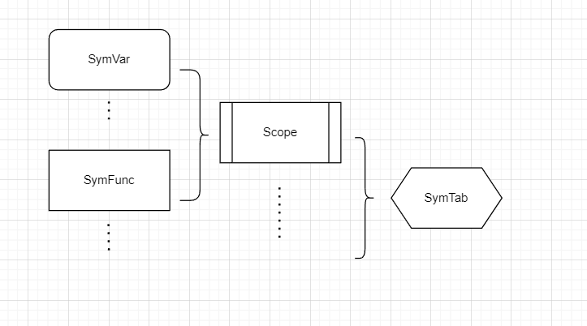

# 设计文档

## 词法分析

首先我们通过

```java
reader = new BufferedReader(new FileReader(file));
```

对文件进行获取，并建立Source封装这个reader，该Source提供了charNum ->lineNum 之间的转换，可以获取对应的行数。同时采用cursor对Source中的内容进行按char访问。

为了对不同的Token进行划分，我们设置了TokeType枚举类来枚举不同的Token类别（包括终结符和非终结符），此后我们用Token对TokenType进行封装，并把Token实际内容放入其中。

此后我们写Lexer, 其主要提供的方法是getToken, 每次调用getToken时，lexer都会对当前cursor所在字符和下一个字符进行判断，确定Token类型，从而得到对应的Token

最后我们调用Lexer.getToken()直到其抛出EOF异常，进行捕获即可。

## 语法分析

首先我们需要建立语法树astTree, 我们设计astbuilder 来辅助建树， 其采用双栈的方式，其中一个栈S1记录递归下降过程中，记录此时子节点的信息还未解析完全的节点， 另一个栈S2记录已经完成子节点信息插入的节点。

例如对文法 A -> A1A2 

我们在 parseA()函数中，会调用parseA1(), parseA2()等， 

1. 在parseA()的最初时，A节点的信息还未更新完全，我们将其插入S1, 
2. 在调用parseA1()完成后，parseA1()函数负责在其函数末段将信息完整的子节点A1插入S2中，
3. 同理调用parseA2()完成后， parseA2()中也会将A2插入S2中， 

此时两个栈的状态为

```ruby
S1: A
s2: A1, A2
```

我们将A从S1中弹出，将A1, A2弹出并插入到A中， 就可以完成树的建立


此后我们就可以在每一个类似的递归下降中使用astbuilder帮助我们建树了。此外我们将左递归文法更改为了A{B}文法，但是为了保证树的形状与左递归文法的语法树相符合，我们可以对建树的流程进行一定的更改：

```java
    // UnaryExp { ('*' | '/' | '%') UnaryExp }
    // MulExp → UnaryExp | MulExp ('*' | '/' | '%') UnaryExp
    public void parseMulExp() throws ParserException {
        try {
            int posRecord = astBuilder.posRecord();
            Node node1 = astBuilder.insertNode(TokenType.MulExp, cursor.atLine(), posRecord);
            parseUnaryExp();
            astBuilder.endBld(node1, cursor.prevTokenAtLine());
            while (cursor.nowToken().getType() == TokenType.MULT
                    || cursor.nowToken().getType() == TokenType.DIV
                    || cursor.nowToken().getType() == TokenType.MOD) {
                parseTerm();
                parseUnaryExp();
                Node node = astBuilder.insertNode(TokenType.MulExp, cursor.atLine(), posRecord);
                astBuilder.endBld(node, cursor.prevTokenAtLine());

            }

        } catch (EOFException e) {
            ;
        }

    }
```

## 符号表



符号表由SymVar(变量符号)、 SymFunc(函数符号)、 Scope（作用域）、SymTab(符号表)组成， 其中SymTab以单例模式，提供定义查找函数、定义查找变量、新建作用域、弹出作用域等功能。

其具体的实现参考了编译教材

每当在CompileUnit、FuncDef、Stmt中的Block最开始，我们定义新的作用域beginScope()，当遍历结束endScope(); 

当定义变量/函数时，会将变量/函数插入到最新的Scope中对应的SymVar/SymFunc列表。

当查找变量时， 优先从栈顶的scope进行查找，查找到为止。

需要注意的是在定义函数时，例如：

```c
int func(int x1, int x2) {
    return 0; 
}
```

其中func应当在外层scope中定义， 但是x1, x2应该在func的scope中定义，但是我们需要在定义func的时候知道funcFparams返回的各个参数的维数，那么我们需要提前获取funcFparams的参数维数。

## 错误处理

我们对AST进行遍历，每层节点分别对相应的错误对应文法及出错符号进行排查。

错误记录我们采用单例的ErrorRecord，同时需要记录上下文信息context作为遍历ast时候传入传出的变量，提供对错误处理必要的上下文信息。

## 中间代码生成

